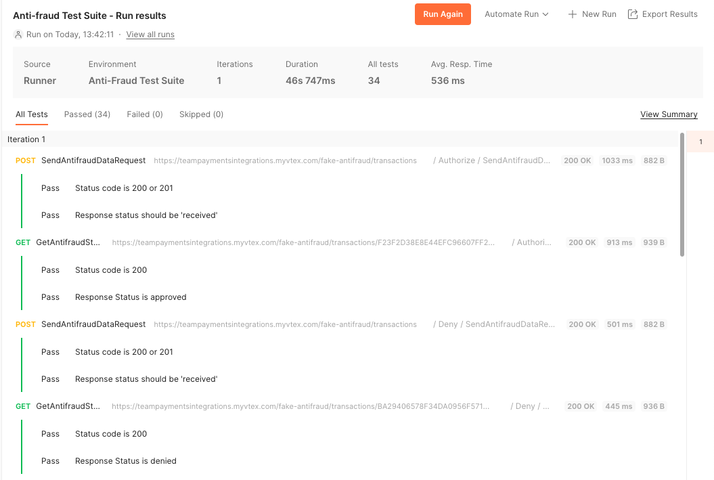

# Anti-fraud Provider Tests

## Disclaimer

Here you can find the Postman assets that will allow you to test the implementation of an Anti-fraud provider, following the [same instructions and test cases](https://developers.vtex.com/docs/guides/how-the-integration-protocol-between-vtex-and-antifraud-companies-works) previously available on the Anti-Fraud Provider Test Suite app.
The collection is organized into folders that represent each test case. The requests required to run each test case are in organized in order.

You will need the tree files available here:
- Collection
- Environment
- Mock Server

In the following section, you will be guided on how to setup each step.

## Getting Started: Setting up the mock server

[Import the collection "Anti-Fraud Webhook Mock".](https://learning.postman.com/docs/getting-started/importing-and-exporting-data/#importing-postman-data)

The mock server is required for sending the webhook calls.

[Create a mock from the collection.](https://learning.postman.com/docs/designing-and-developing-your-api/mocking-data/setting-up-mock/#creating-a-mock-from-a-collection)

Also, make sure to copy the Mock URL for later use.

## Getting Started: Environment Variables

[Import the environment.](https://learning.postman.com/docs/getting-started/importing-and-exporting-data/#importing-postman-data)

Set the values for the variables:
 - serviceUrl: URL of your provider service.
 - appKey and appToken: credential values that the merchant will configure to authenticate with the provider. They are sent in all requests as X-PROVIDER-API-AppKey and X-PROVIDER-API-AppToken headers.
 - accountName: the name of the VTEX account that will be processing payments with this anti-fraud provider.
 - mockServerAddress: the Mock URL copied in the previous step.

## Running the Tests

[Import the collection "Anti-Fraud Test Suite".](https://learning.postman.com/docs/getting-started/importing-and-exporting-data/#importing-postman-data)

[Run the collection.](https://learning.postman.com/docs/collections/running-collections/intro-to-collection-runs/)

We recommend using a **2000ms delay** between requests.
